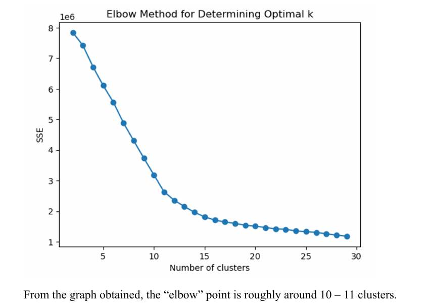
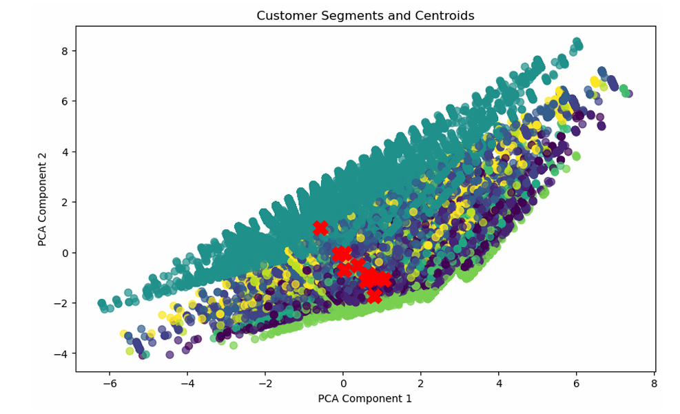
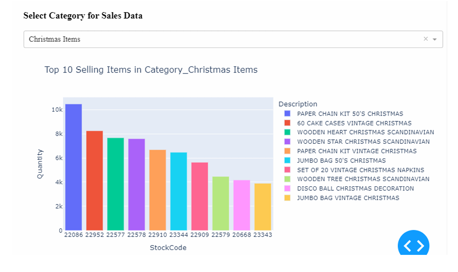

# 📊 Customer Segmentation using K-Means Clustering

## 📌 Overview
This project applies unsupervised machine learning to segment customers based on purchasing behaviour using the Online Retail dataset. The objective is to identify meaningful customer groups that can support business decisions in marketing, inventory planning, and customer retention.

The project follows a full data science workflow, including:
- business understanding
- data understanding
- data preparation
- modelling
- evaluation
- deployment planning
- dashboard and visualization

---

## 🎯 Business Objective
The main goal of this project is to use data-driven insights to understand customer purchasing behaviour and identify distinct customer segments. These segments can help businesses:
- improve targeted marketing
- optimize inventory management
- enhance customer retention
- support sales growth

According to the project report, the business questions include identifying top customer segments, product category performance, and geographical or seasonal purchasing trends. :contentReference[oaicite:3]{index=3}

---

## 🧠 Project Goals
- Segment customers based on purchasing behaviour
- Analyze product category performance
- Study geographical and seasonal purchasing trends
- Compare clustering models and distance metrics
- Generate business insights for practical deployment

The project specifically targeted customer segmentation, product category analysis, and geographical/seasonal trend analysis. :contentReference[oaicite:4]{index=4}

---

## 📂 Dataset
**Dataset:** Online Retail Dataset  
**Source:** UCI Machine Learning Repository  
**Domain:** UK-based online retail transaction data  

The dataset contains transactional records from December 2010 to December 2011, with 541,909 records and 8 attributes. :contentReference[oaicite:5]{index=5} :contentReference[oaicite:6]{index=6}

### Key Attributes
- `InvoiceNo` – transaction identifier
- `StockCode` – product identifier
- `Description` – product name
- `Quantity` – number of units purchased
- `InvoiceMonth` – month of transaction
- `UnitPrice` – price per unit
- `CustomerID` – customer identifier
- `Country` – customer country

These attributes are described in the report’s data understanding section. :contentReference[oaicite:7]{index=7}

---

## 🛠️ Technologies Used
- Python
- Jupyter Notebook
- Pandas
- NumPy
- Matplotlib
- Seaborn
- Scikit-learn
- Excel

The report states that Python, Pandas, NumPy, Scikit-learn, Matplotlib, Seaborn, Dash, and Plotly were used across the workflow. :contentReference[oaicite:8]{index=8}

---

## 🔍 Data Preprocessing
The dataset was cleaned and transformed before modelling.

### Data Cleaning
- Removed missing values in `Description` because the proportion was very small
- Replaced missing `CustomerID` values with `"Unknown"` instead of deleting nearly a quarter of the data
- Handled outliers in `UnitPrice`
- Capped outliers in `Quantity`
- Replaced ambiguous product descriptions such as `?` or `wrong` with `"Unknown / Issue Reported"`

These preprocessing decisions are documented in the report’s data quality and data cleaning sections. :contentReference[oaicite:9]{index=9}

### Feature Engineering
New features were created to improve analysis:
- `TotalPrice = Quantity × UnitPrice`
- `InvoiceMonth`
- `Category` derived from product descriptions

This construction of required data is explained in the report. :contentReference[oaicite:10]{index=10}

### Data Aggregation
Customer-level aggregated features were created:
- `TotalQuantity`
- `TransactionNum`
- `AvgPurchaseAmount`
- `TotalSpent`
- `PercentReturned`

These features summarize customer purchasing behaviour for segmentation. :contentReference[oaicite:11]{index=11}

### Encoding and Scaling
- `Country` was simplified into United Kingdom vs. other countries and then encoded
- Product `Category` was one-hot encoded
- Numerical features were standardized and scaled before clustering

These transformation steps are described in the data preparation section. :contentReference[oaicite:12]{index=12}

---

## 📈 Exploratory Data Analysis
The project included descriptive analytics and visualization such as:
- quantity distribution
- unit price distribution
- purchase frequency per customer
- top countries
- top-selling products
- monthly sales trend
- quantity vs. unit price relationship

Some notable findings from the report:
- the UK dominated transactions
- most customers had low purchase frequency
- sales generally increased over the year and peaked in November
- the top-selling items were mostly decorative and gift-related products

These observations appear throughout the EDA section. :contentReference[oaicite:13]{index=13}

---

## 🤖 Modelling
Two unsupervised learning models were implemented:
- **K-Means Clustering**
- **MiniBatch K-Means Clustering**

The report selected unsupervised learning because there was no predefined target variable. :contentReference[oaicite:14]{index=14}

### Evaluation Methods
The clustering models were evaluated using:
- Elbow Method
- Silhouette Score
- Hyperparameter Tuning
- PCA visualization
- Distance metric comparison

These methods are documented in the modelling section. :contentReference[oaicite:15]{index=15}

---

## 🏆 Model Selection
A total of four model variants were compared:
- KMeans
- KMeans with cosine distance
- MiniBatchKMeans
- MiniBatchKMeans with cosine distance

The final selected model was **K-Means**, mainly because it achieved the highest silhouette score of approximately **0.474** and provided richer, more actionable cluster profiles with 11 clusters. :contentReference[oaicite:16]{index=16}

### Selected Model
- **Model:** K-Means Clustering
- **Number of clusters:** 11
- **Silhouette score:** 0.474

The report states this explicitly in the model selection section. :contentReference[oaicite:17]{index=17}

---

## 📊 Key Results
The selected K-Means model segmented customers into 11 clusters representing different purchasing patterns. The report summarizes clusters such as:
- Decorative Items
- Christmas Items
- Kitchenware
- Household Items
- Easter Items
- Fashion Accessories
- Gift Items
- Stationery
- Toys
- Gardening Items
- Others / Varied purchases

The largest cluster represented general purchases across varied categories, while smaller clusters captured more niche or seasonal customer behaviours. :contentReference[oaicite:18]{index=18}

### Business Insights
The project identified that:
- cluster-specific campaigns can improve marketing effectiveness
- product categories should be stocked according to demand patterns
- holiday-related items should be promoted seasonally
- high-spending clusters can be targeted for loyalty and retention programs

These proposed actions and decisions are included in the evaluation section. :contentReference[oaicite:19]{index=19}

---

## 📉 Limitations
Some limitations highlighted in the report include:
- moderate silhouette score, meaning some overlap still exists between clusters
- skewed cluster distribution, with one dominant cluster much larger than others
- room to improve customer behaviour modelling with more features such as purchase frequency and browsing history

These limitations are discussed in the report conclusion and evaluation sections. :contentReference[oaicite:20]{index=20} :contentReference[oaicite:21]{index=21}

---

## 🚀 Future Improvements
Possible future improvements include:
- adding more behavioural features
- improving dashboard interactivity
- updating clusters regularly with new data
- integrating clustering outputs into CRM and recommendation systems
- trying more advanced clustering techniques

The report also proposes deployment into CRM, automated product recommendations, inventory optimization, and targeted campaigns. :contentReference[oaicite:22]{index=22}

---

## 🖼️ Project Preview
Add screenshots here later, for example:
- Elbow Method graph
- Silhouette Score comparison
- PCA cluster visualization
- Dashboard screenshots

Example:
```markdown


